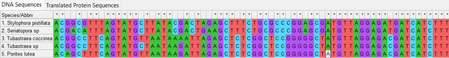
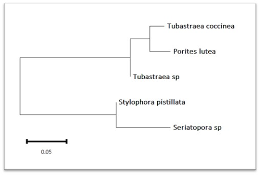

#  Bioinformatics Project: Primer Design and Phylogeny of Stylophora pistillata

### 1. Project Objective
**Title:** Designing Primers and Building a Phylogenetic Tree for the Coral *Stylophora pistillata* (COX1 Gene).

**Objective:** For this project, I chose to work on *Stylophora pistillata* because it is the main focus of my M.Sc. research. My goal was to design specific PCR primers for its mitochondrial COX1 gene and see how it relates to other corals using a phylogenetic tree.

### 2. Target Species and Gene
* **The Organism:** *Stylophora pistillata*. It is a very important reef-building coral.
* **The Gene:** Mitochondrial COX1 (Cytochrome c oxidase subunit I).
* **Why I used this gene:** COX1 is the standard "barcode" for identifying animals. It is great for this project because it has enough differences to tell species apart, but also has stable areas where I can design primers.

### 3. Collecting Sequences from NCBI
I went to the NCBI GenBank website and searched for COX1 sequences in FASTA format. I chose the following sequences for my analysis:
* *Stylophora pistillata* (Target): AB441231.1
* *Seriatopora sp.*: AB441233
* *Tubastraea coccinea*: AB441235
* *Tubastraea sp.*: AB441238.1
* *Porites lutea*: AB441243.1

### 4. Sequence Alignment
I aligned these five sequences to find the best spots for my primers and to see where the DNA differs between species.
* **Software:** MEGA12 (using the ClustalW tool).
* **What I found:** In the alignment, I saw very stable (conserved) regions where all species were identical. I also found variable spots (SNPs) that are unique to the *Stylophora* and *Seriatopora* group.

 

**My Alignment Result:**

 

### 5. Primers Design
I used the alignment to find the best flanking regions for my primers. I wanted to make sure they are specific to my target.
* **Software:** NCBI Primer-BLAST.
* **Forward Primer:** GATATGGCGTTTCCCCGACT
* **Reverse Primer:** CGAACCTCCAGAGTGTGCTT
* **Primer Details:**  Length: 20 bp each.
 * **Melting Temperature (Tm):** 59.89°C (Forward) | 59.97°C (Reverse)
  * **GC Content:** 55%.
* **Expected PCR Product:** 156 bp.
 

### 6. Verification
I checked my primers again using NCBI Primer-BLAST. The results showed that these primers are specific to *Stylophora* and should not amplify other organisms by mistake.

### 7. Building the Phylogenetic Tree
To see the evolutionary connections, I made a tree using the aligned COX1 sequences.
* **Software:** MEGA12.
* **Method:** Neighbor-Joining (NJ).
* **Model:** Kimura 2-parameter (K2P).
* **Test:** 1000 bootstrap replicates to make sure the tree is strong.

 

**Final Phylogenetic Tree:**

### 8. Interpretation of the Tree
Looking at the tree, I can see a few interesting things:
* **Clustering:** As I expected, *Stylophora pistillata* is very close to *Seriatopora sp.* They belong to the same family (Pocilloporidae), and the tree shows this clearly.
* **Other Groups:** The other corals like *Tubastraea* and *Porites* are on different branches, which makes sense because they are more distantly related.
* **Bootstrap Values:** The high numbers at the branches show that my results are statistically reliable.