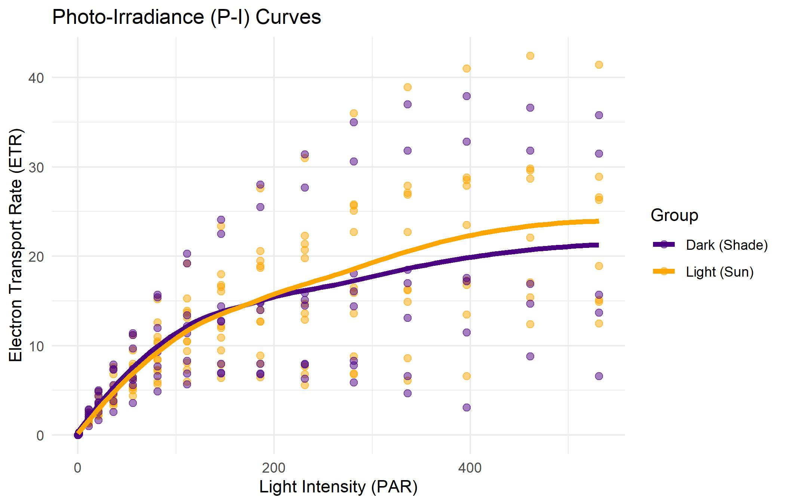
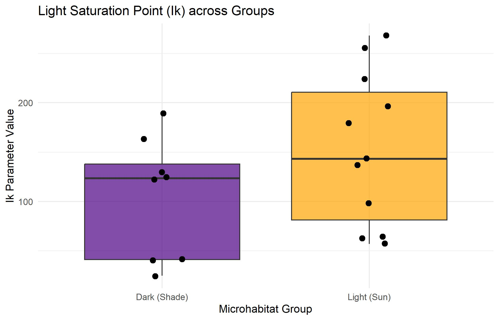

# Photophysiological Analysis and Microhabitat Acclimation of Marine Macroalgae

## 1. Introduction
Marine macroalgae are important primary producers in coastal rocky shore ecosystems. In the intertidal zone, algae can grow in very different light conditions: some are exposed to direct sunlight, while others grow in shaded places such as crevices or under rocks. Since photosynthesis depends strongly on light, algae from these different microhabitats may show different photosynthetic responses.

In this project, we compared macroalgae collected from light‑exposed and shaded microhabitats at Sdot Yam. Photosynthetic performance was measured using Pulse‑Amplitude‑Modulation (PAM) fluorometry across increasing light intensities (photosynthetically active radiation, PAR). From the electron transport rate (ETR) response curves, four main parameters were extracted: the maximum ETR (Am), apparent quantum yield (AQY), dark respiration (Rd) and the light‑saturation parameter (Ik, calculated as Am/AQY). The aim of the analysis was to describe possible differences between the Light and Dark groups using the extracted parameters, summary tables and graphs.

 

## Materials and Methods

### Field sampling

The study was conducted on 16 April 2026 at the shallow, intertidal rocky shore of Sdot Yam, Israel. To capture the range of microhabitats along this shoreline, the class was divided into four sampling teams that walked parallel transects in different compass directions (north‑to‑south, south‑to‑north, east‑to‑west and west‑to‑east). Along each transect the students placed a 25‑square (5 × 5) quadrat grid over the rock surface at regular intervals. Within each quadrat they noted the percent cover and taxonomy of the macroalgae present and whether the specimens were growing in full sun or in a shaded niche. Representative samples were collected from each quadrat, labelled with the taxon and microhabitat, and transported to the laboratory.

For the subsequent analysis the specimens were pooled by light environment. Algae growing on open, sun‑exposed rock surfaces were classified as the Light group, whereas those taken from crevices, caves or under overhangs were classified as the Dark group.

 

### Laboratory measurements

In the laboratory each specimen was placed individually in a Petri dish filled with ambient seawater to maintain physiological conditions. Photosynthesis was evaluated using a pulse‑amplitude‑modulated fluorometer (PAM). Each dish was exposed to a series of increasing light steps from 0 to 600 µmol photons m⁻² s⁻¹. At each step the instrument measured chlorophyll fluorescence to estimate the effective quantum yield of photosystem II (Y(II)).
The instantaneous electron transport rate (ETR) at each light level was calculated as:

<b>ETR = Y(II) × PAR × 0.5 × 0.84</b>

where 0.5 assumes that half of the absorbed photons excite photosystem II and 0.84 is an average light‑absorption coefficient for macroalgal tissue. This relationship converts the fluorescence yield into an estimate of photosynthetic electron transport.

 

### Data processing and parameter extraction

All data processing and analysis were carried out in R (4.3.0) using packages from the tidyverse (dplyr, tidyr), lubridate, hms, broom, ggplot2 and patchwork. Raw ETR–PAR data were cleaned by setting ETR values of zero at non‑zero light steps to missing values. Two Light samples (Light_3 and Light_9) were discarded because their ETR–PAR curves were highly erratic and the non‑linear model could not be fitted reliably.

For each remaining sample, a hyperbolic tangent model was fitted to the ETR versus PAR curve using the nls() function. This yielded estimates of four photophysiological parameters: Am (the asymptotic maximum ETR at saturating light), AQY (the initial slope at low light, indicating photon‑harvesting efficiency), Rd (dark respiration, negative values indicate net energy loss) and Ik (the light‑saturation point, computed as Am/AQY). Parameter values were exported to a comma‑separated values (CSV) file and to an Excel workbook that includes a ReadMe sheet explaining each parameter and its units. The analysis script and the R workspace (.RData file) were saved to facilitate reproducibility.

 

## Results

A total of 19 usable samples were analysed: 11 from the Light microhabitat and 8 from the Dark microhabitat. Table 1 summarises the number of replicates (n), arithmetic mean, standard deviation (SD) and median for each parameter within each group. Overall, maximum electron‑transport capacity (Am) was similar between Light and Dark algae. Shade‑adapted algae (Dark group) showed higher photon‑harvesting efficiency (AQY) but reached light saturation (Ik) at lower irradiance than the sun‑exposed algae. Dark respiration (Rd) was slightly negative for Light samples and positive for Dark samples.

 

<h3>Table 1 – Descriptive statistics of photophysiological parameters</h3>
<table>
  <thead>
    <tr>
      <th>Parameter</th>
      <th>Group</th>
      <th>n</th>
      <th>Mean</th>
      <th>SD</th>
      <th>Median</th>
    </tr>
  </thead>
  <tbody>
    <tr>
      <td rowspan="2" style="text-align: center; vertical-align: middle;"><b>Am</b> (µmol electrons m⁻² s⁻¹)</td>
      <td>Dark</td>
      <td>8</td>
      <td>17.07</td>
      <td>13.62</td>
      <td>14.83</td>
    </tr>
    <tr>
      <td>Light</td>
      <td>11</td>
      <td>20.82</td>
      <td>13.61</td>
      <td>17.73</td>
    </tr>
    <tr>
      <td rowspan="2" style="text-align: center; vertical-align: middle;"><b>AQY</b> (dimensionless)</td>
      <td>Dark</td>
      <td>8</td>
      <td>0.22</td>
      <td>0.08</td>
      <td>0.21</td>
    </tr>
    <tr>
      <td>Light</td>
      <td>11</td>
      <td>0.16</td>
      <td>0.03</td>
      <td>0.15</td>
    </tr>
    <tr>
      <td rowspan="2" style="text-align: center; vertical-align: middle;"><b>Rd</b> (µmol electrons m⁻² s⁻¹)</td>
      <td>Dark</td>
      <td>8</td>
      <td>0.03</td>
      <td>0.26</td>
      <td>0.13</td>
    </tr>
    <tr>
      <td>Light</td>
      <td>11</td>
      <td>-0.12</td>
      <td>0.29</td>
      <td>-0.03</td>
    </tr>
    <tr>
      <td rowspan="2" style="text-align: center; vertical-align: middle;"><b>Ik</b> (µmol photons m⁻² s⁻¹)</td>
      <td>Dark</td>
      <td>8</td>
      <td>88.12</td>
      <td>69.64</td>
      <td>81.64</td>
    </tr>
    <tr>
      <td>Light</td>
      <td>11</td>
      <td>143.89</td>
      <td>90.45</td>
      <td>143.22</td>
    </tr>
  </tbody>
</table>

 
 

### Figures

The light‑response curves (Figure 1) and the distribution of the light‑saturation parameter (Figure 2) visualise these trends. In Figure 1 the ETR increases with light for all samples but the Light group (orange lines) maintains higher ETR at high irradiance and reaches saturation later than the Dark group (purple lines). Figure 2 shows that Ik values of the Light samples are generally higher and more variable than those of the Dark samples.

 
 

*Figure 1 – Photo‑irradiance (P–I) response curves showing the electron transport rate (ETR) across increasing photosynthetically active radiation (PAR) for Light (orange) and Dark (purple) macroalgae. Each line represents a single sample.*

 
 
 

*Figure 2 – Distribution of the light‑saturation parameter (Ik) for the Light (orange) and Dark (purple) groups. Points show individual samples; boxes represent the interquartile range with the median.*

 

## Conclusions

The patterns observed in this study suggest that macroalgae from Sdot Yam adjust their photophysiological characteristics to match the light environment. Shade‑dwelling specimens exhibited higher apparent quantum yield (AQY), indicating that they are more efficient at harvesting light under dim conditions. However, they reached their light‑saturation point (Ik) at relatively low irradiance, reflecting an acclimation to low‑light microhabitats. In contrast, sun‑exposed algae had lower AQY but much higher Ik values, enabling them to continue increasing electron transport at higher light levels without saturating. Maximum potential capacity (Am) was similar between groups, indicating that both sun and shade morphs have comparable upper limits on photosynthetic electron transport.
